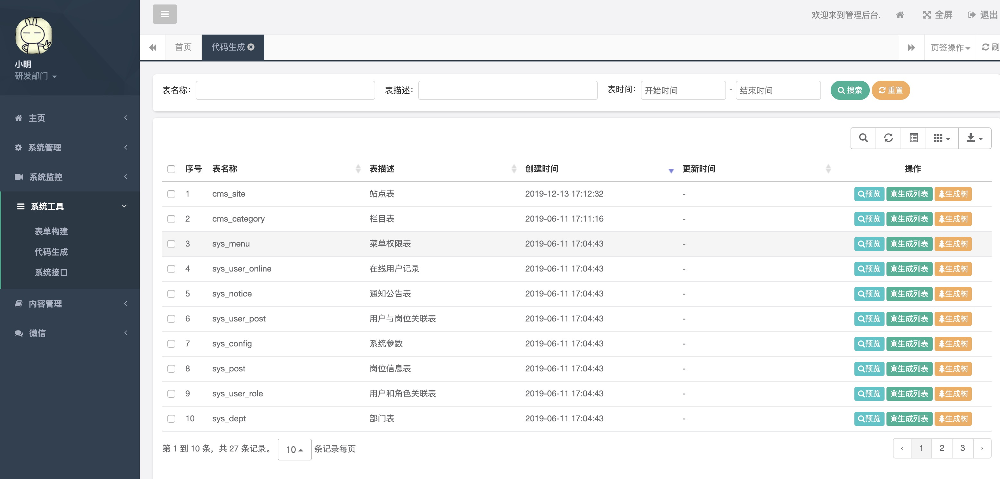
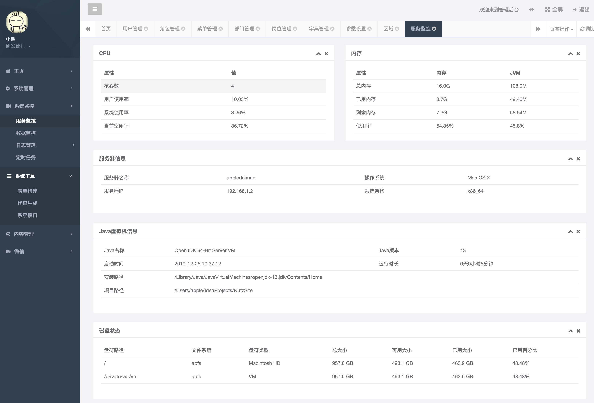

<p align="center"><a href="https://tomyule.github.io/NutzSite/" target="_blank"></a></p>

[](https://travis-ci.org/TomYule/NutzSite)
[](https://github.com/nutzam/nutz)
[](https://github.com/TomYule/NutzSite/blob/master/LICENSE)  
## NutzSite基于Nutz的Java开源企业级快速开发框架  

# 简介
Java快速开发框架 基于nutz框架；支持 任意SQL数据库,例如MySQL,Oracle,SqlServer等等;去繁从简，简约而不简单: 一对多 多对多复杂关系数据保存用nutz 就是那么简单;
优势:支持各类数据库 代码生成；别人还在加班熬夜 重复增删改查时 你已经通过工具 写完所有;最大限度的提高 Java 开发人员的生产力;有更多的时间陪伴家人,陪伴对象

*Talk is cheap. Show me the code!!*  
文档地址: [NutzSite](https://www.showdoc.com.cn/NutzSite)

## 技术选型
* 核心框架：[Nutz](https://github.com/nutzam/nutz)、[Nutzboot](https://github.com/nutzam/nutzboot)
* 扩展功能：[nutz-plugins-slog](https://github.com/nutzam/nutzmore/tree/master/nutz-plugins-slog)日志记录 、 [nutz-plugins-validation](https://github.com/nutzam/nutzmore/tree/master/nutz-plugins-validation)数据校验
* 数据库连接池：[Druid](https://github.com/alibaba/druid)
* 安全框架：[Shiro](https://github.com/apache/shiro)、 [JWT](https://github.com/jwtk/jjwt)
* 模板引擎： [Thymeleaf](https://github.com/thymeleaf/thymeleaf)
* 订阅发布：[Redis](https://github.com/antirez/redis)
* 缓存：[Caffeine](https://github.com/ben-manes/caffeine)  为什么选择Caffeine [各缓存性能对比](https://github.com/ben-manes/caffeine/wiki/Benchmarks)
* 任务调度：[Quartz](https://github.com/quartz-scheduler/quartz) 

## 主要功能
1. 支持 任意SQL数据库,例如MySQL,Oracle,SqlServer 等等 让数据库选择更加适合 项目
2. 完全响应式布局（支持电脑、平板、手机等所有主流设备）
3. 用户管理：用户是系统操作者，该功能主要完成系统用户配置。
4. 部门管理：配置系统组织机构（公司、部门、小组），树结构展现。
5. 岗位管理：配置系统用户所属担任职务。
6. 菜单管理：配置系统菜单，操作权限，按钮权限标识等。
7. 角色管理：角色菜单权限分配、设置角色按机构进行数据范围权限划分。
8. 字典管理：对系统中经常使用的一些较为固定的数据进行维护。
9. 参数管理：对系统动态配置常用参数。
10. 通知公告：系统通知公告信息发布维护。
11. 操作日志：系统正常操作日志记录和查询；系统异常信息日志记录和查询。
12. 登录日志：系统登录日志记录查询包含登录异常。
13. 定时任务：在线（添加、修改、删除)任务调度包含执行结果日志。
14. 代码生成：前后端代码的生成（java、html、xml、sql)支持CRUD下载 。
15. 系统接口：根据业务代码自动生成相关的api接口文档。
16. 服务监控：监视当前系统CPU、内存、磁盘、堆栈等相关信息。
17. 在线构建器：拖动表单元素生成相应的HTML代码:表单,下拉列表搜索,ztree,文件上传,地图选择位置 等等。
18. 连接池监视：监视当前系统数据库连接池状态，可进行分析SQL找出系统性能瓶颈。   
其它功能:RSA加密,XSS攻击过滤 SQL注入过滤,微信公众平台集成, CMS 内容发布系统 ,支付宝,阿里云消息推送,高德地图,七牛云,Excel 导出数据  案例: 系统管理-参数设置  
## 后期支持待完善功能
* 审批流

项目截图



## 为什么选择nutz
追求卓越 成功会找上你   
nutz Java小伙伴们的另一种选择

本压缩包是一个maven工程, eclipse/idea均可按maven项目导入

MainLauncher是入口,启动即可

## 环境要求

* 建议 JDK8+ 支持OpenJDK 
* 数据库 任意SQL数据库,例如MySQL,Oracle,SqlServer等等
* eclipse或idea等IDE开发工具,可选

## 配置信息位置

数据库配置信息,jetty端口等配置信息,均位于src/main/resources/application.properties  
代码生成 位于src/main/resources/gen.properties  
目前支持MySQL,db2,PostgreSql 数据库 代码生成
注意: 数据库表名需要有备注

## 命令下启动

仅供测试用,使用mvn命令即可

```
// for windows
set MAVEN_OPTS="-Dfile.encoding=UTF-8"
mvn compile nutzboot:run

// for *uix
export MAVEN_OPTS="-Dfile.encoding=UTF-8"
mvn compile nutzboot:run
```

## 项目打包

```
mvn clean package nutzboot:shade
mvn clean package nutzboot:shade nutzboot:war
```

请注意,当前需要package + nutzboot:shade, 单独执行package或者nutzboot:shade是不行的

## 相关资源

* 论坛: https://nutz.cn
* 官网: https://nutz.io
* 一键生成NB的项目: https://get.nutz.io
* 项目 参考 [RuoYi](https://gitee.com/y_project/RuoYi-fast)
,[nutzwk](https://github.com/Wizzercn/NutzWk/tree/bak-delete-v3-bootstrap) 
,[mybatis-plus-generator](https://gitee.com/baomidou/mybatis-plus/tree/3.0/mybatis-plus-generator)  
* 推荐项目: [jhipster](https://www.jhipster.tech/cn/), [NutzWk](https://gitee.com/wizzer/NutzWk)  

## 鸣谢
*   nutz 项目的所有贡献者
*   感谢各开源项目作者
*   [@wendal](https://github.com/wendal) (代码贡献者,技术大牛,Nutz主要作者,无所不知且乐于助人)

## 我想改变行业的未来,因为我有一颗改变世界的心 
1024 - 梦想，永不止步!  
身怀宝藏，一心憧憬星辰大海  
追求极致，目标始于高山之巅  
一群怀揣好奇，梦想改变世界的孩子  
一群追日逐浪，正在改变世界的极客  
你们用最美的语言，诠释着科技的力量  
你们用极速的创新，引领着时代的变迁  
------至所有正在努力奋斗的程序猿们！加油！！  
  
# 关于  
本项目完全开源，商用完全免费。但请勿侵犯作者合法权益，如申请软著等。

QQ群: 68428921(已满) 24457628(2群) 58444676(老吹水群)