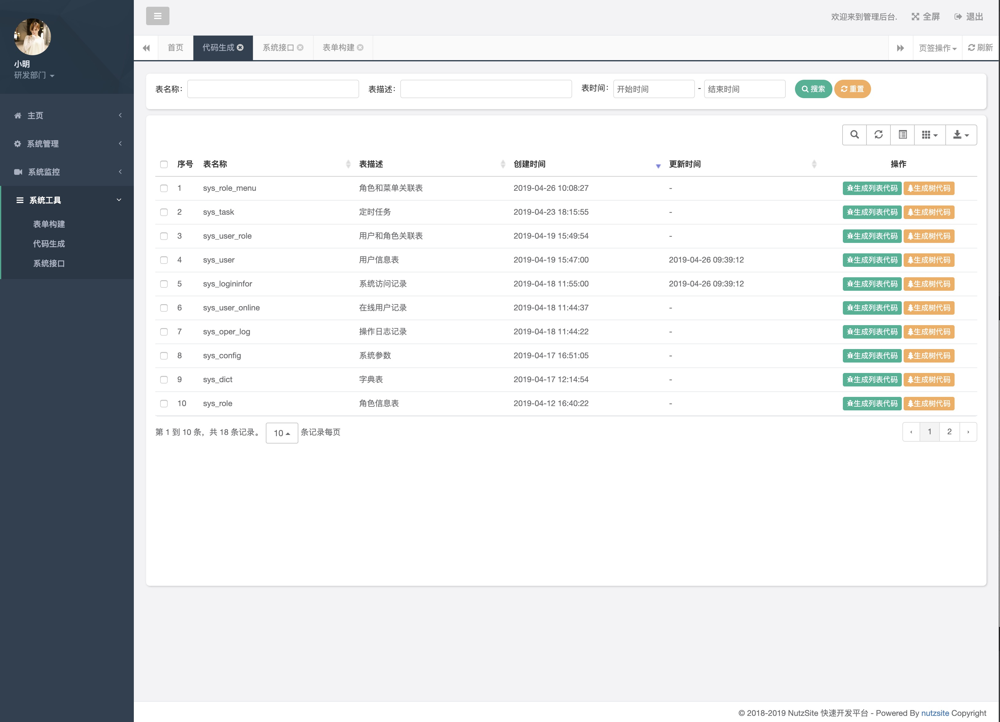

[](https://www.apache.org/licenses/LICENSE-2.0.html)  
NutzSite基于Nutz的开源企业级开发框架  

# 简介
一直想做一款后台管理系统，看了很多优秀的开源项目但是发现没有合适自己的。于是利用空闲休息时间开始自己写一套后台系统。如此有了NutzSite管理系统。 网站管理后台 系统会陆续更新一些实用功能。
项目截图


## 目前支持
* Nutz
* Nutzboot
* Druid
* Shiro
* Thymeleaf
* Quartz 定时任务
* SLog日志记录
* 支付宝
* 微信公众平台
* 阿里云消息推送
* 阿里云短信
* 高德地图
* 七牛云
* XSS攻击过滤 SQL注入过滤
* Excel 导出数据
## 给自己挖坑 后期支持待完善功能
* 审批流
* CMS

本压缩包是一个maven工程, eclipse/idea均可按maven项目导入

MainLauncher是入口,启动即可

## 环境要求

* 必须JDK8+
* eclipse或idea等IDE开发工具,可选

## 配置信息位置

数据库配置信息,jetty端口等配置信息,均位于src/main/resources/application.properties

## 命令下启动

仅供测试用,使用mvn命令即可

```
// for windows
set MAVEN_OPTS="-Dfile.encoding=UTF-8"
mvn compile nutzboot:run

// for *uix
export MAVEN_OPTS="-Dfile.encoding=UTF-8"
mvn compile nutzboot:run
```

## 项目打包

```
mvn clean package nutzboot:shade
```

请注意,当前需要package + nutzboot:shade, 单独执行package或者nutzboot:shade是不行的

## 相关资源

* 论坛: https://nutz.cn
* 官网: https://nutz.io
* 一键生成NB的项目: https://get.nutz.io
* 项目80%参考 RuoYi: https://gitee.com/y_project/RuoYi
* 部分代码 参考 nutzwk : https://github.com/Wizzercn/NutzWk/tree/bak-delete-v3-bootstrap

## 鸣谢
*   [@wendal](https://github.com/wendal) (代码贡献者,技术大牛,Nutz主要作者,无所不知且乐于助人)

## 我想改变行业的未来,因为我有一颗改变世界的心
有码走遍天下 无码寸步难行（引自网络）  
1024 - 梦想，永不止步!  
爱编程 不爱Bug  
爱加班 不爱黑眼圈  
固执 但不偏执  
疯狂 但不疯癫  
生活里的菜鸟  
工作中的大神  
身怀宝藏，一心憧憬星辰大海  
追求极致，目标始于高山之巅  
一群怀揣好奇，梦想改变世界的孩子  
一群追日逐浪，正在改变世界的极客  
你们用最美的语言，诠释着科技的力量  
你们用极速的创新，引领着时代的变迁  
------至所有正在努力奋斗的程序猿们！加油！！  